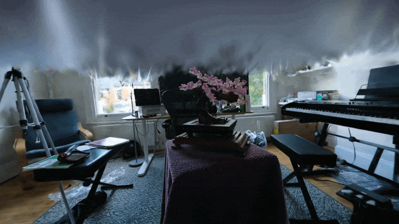
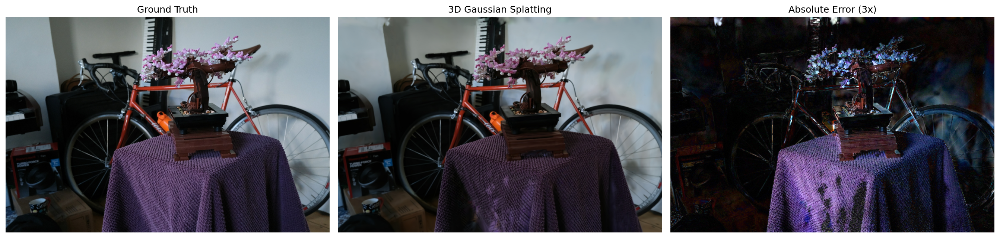

# Novel View Synthesis with 3D Gaussian Splatting

A small-scale novel-view synthesis project using **3D Gaussian Splatting (3DGS)** to reconstruct the Mip-NeRF 360 **Bonsai** scene from multi-view images and synthesize images from previously unseen camera viewpoints.

The project uses **Nerfstudio's Splatfacto implementation** of 3D Gaussian Splatting with the **gsplat** CUDA rasterization backend.

The trained scene was evaluated on held-out camera views using **PSNR, SSIM, and LPIPS**, followed by qualitative comparison against ground-truth photographs and the generation of a continuous novel-view camera trajectory through the reconstructed scene.

---

## Demo



The camera trajectory above is rendered from the trained 3D Gaussian representation. The virtual camera moves continuously between viewpoints rather than simply replaying the original photographs.

This demonstrates the fundamental novel-view synthesis pipeline:

```text
Multi-view photographs
        ↓
Camera pose estimation / COLMAP reconstruction
        ↓
3D Gaussian Splatting optimization
        ↓
Learned 3D scene representation
        ↓
Render arbitrary virtual camera poses
        ↓
Novel views
```

---

## Results

The model was trained for approximately **30,000 optimization steps** and evaluated on held-out images that were excluded from training.

| Metric | Result | Interpretation |
|---|---:|---|
| **PSNR** | **31.54 dB** | Higher is better |
| **SSIM** | **0.9363** | Higher is better |
| **LPIPS** | **0.1384** | Lower is better |
| **Evaluation rendering speed** | **17.19 FPS** | Measured during evaluation |

The results indicate strong structural similarity between synthesized views and the corresponding real photographs, while differences remain in fine textures, illumination, thin structures, and regions with weaker multi-view coverage.

### Ground Truth vs. Novel View



The figure contains:

1. **Ground Truth** — the real held-out photograph.
2. **3D Gaussian Splatting** — the synthesized image produced from the same camera pose.
3. **Absolute Error (3×)** — absolute RGB difference between the two images, amplified by a factor of three for visualization.

The synthesized image preserves the overall scene geometry and appearance convincingly. The most visible differences occur in high-frequency regions such as the purple fabric, small bonsai elements, thin bicycle structures, and local illumination.

The error visualization is intended as a qualitative diagnostic and is not itself an evaluation metric.

---

# 1. Project Goal

The goal of this project was to build a small end-to-end **novel-view synthesis** experiment.

Given photographs of a scene captured from multiple known viewpoints, the system reconstructs a 3D representation that can subsequently be rendered from camera positions that were not used during training.

Conceptually:

```text
Images from known viewpoints
             ↓
       Reconstruct scene
             ↓
    Learn 3D representation
             ↓
   Choose a new camera pose
             ↓
     Synthesize new image
```

Instead of capturing a new dataset manually, this project uses the established **Bonsai** scene from the **Mip-NeRF 360** dataset.

This provides:

- multi-view RGB photographs,
- calibrated cameras,
- COLMAP reconstruction data,
- an established train/test split,
- and a scene commonly used for novel-view synthesis research.

---

# 2. Method: 3D Gaussian Splatting

This project uses **3D Gaussian Splatting (3DGS)** through Nerfstudio's **Splatfacto** implementation.

Rather than representing a scene using a conventional triangle mesh, the scene is represented using a large collection of optimized 3D Gaussians.

Each Gaussian contains properties describing aspects such as:

- 3D position,
- spatial scale,
- orientation,
- opacity,
- and appearance/color information.

During optimization, these Gaussians are adjusted so that rendering the scene from the training cameras reproduces the corresponding input photographs.

A simplified optimization loop is:

```text
COLMAP sparse reconstruction
          ↓
Initialize 3D Gaussians
          ↓
Select training camera
          ↓
Render current Gaussian scene
          ↓
Compare render with real image
          ↓
Calculate loss
          ↓
Update Gaussian parameters
          ↓
Densify / refine representation
          ↓
Repeat
```

After training, the Gaussian representation can be rasterized efficiently from arbitrary camera viewpoints.

---

# 3. Software Stack

The project was developed and executed on **Windows**.

## Hardware

GPU:

```text
NVIDIA GeForce RTX 3070 Laptop GPU
VRAM: 8 GB
```

The installed NVIDIA driver reported support for CUDA 13.1. However, the final Python environment intentionally uses a **PyTorch CUDA 12.4 runtime** for compatibility with the precompiled gsplat backend.

## Final Working Environment

```text
Python:       3.10
PyTorch:      2.4.1+cu124
CUDA runtime: 12.4
Nerfstudio:   1.1.5
gsplat:       1.4.0+pt24cu124
NumPy:        1.26.4
OpenCV:       4.10.0
```

---

# 4. Why a Specific CUDA / PyTorch Environment Was Used

An important practical part of this project was obtaining a stable Windows CUDA environment.

An initial environment used a much newer software stack:

```text
Python 3.11
PyTorch 2.14
CUDA 13.x
```

PyTorch could successfully detect the GPU, but gsplat attempted to compile its CUDA extension locally and ultimately failed to load the resulting DLL.

The project was therefore moved to a known compatible configuration:

```text
Python 3.10
PyTorch 2.4.1
CUDA 12.4
```

A precompiled Windows gsplat wheel was then used:

```text
gsplat 1.4.0+pt24cu124
```

This avoided runtime compilation of the Gaussian rasterizer and provided a working CUDA backend.

Nerfstudio 1.1.5 specifically requires:

```text
gsplat == 1.4.0
```

so the CUDA 12.4 / PyTorch 2.4 build of gsplat 1.4.0 was used.

This compatibility issue is worth noting when reproducing the project on Windows.

---

# 5. Dataset

The project uses the **Bonsai** scene from the **Mip-NeRF 360** dataset.

The dataset was obtained through NerfBaselines.

The processed dataset contained:

```text
data/bonsai/
├── images_2/
├── sparse_2/
│   └── 0/
├── nb-info.json
├── train_list.txt
├── test_list.txt
└── val_list.txt
```

There are:

```text
292 images
```

at approximately:

```text
1559 × 1039 pixels
```

The `images_2` directory contains images already downsampled by a factor of two from the original dataset.

The dataset metadata specifies:

```json
{
    "loader": "colmap",
    "loader_kwargs": {
        "images_path": "images_2",
        "colmap_path": "sparse_2/0"
    },
    "id": "mipnerf360",
    "scene": "bonsai",
    "downscale_factor": 2,
    "evaluation_protocol": "nerf",
    "type": "object-centric",
    "version": "1"
}
```

---

# 6. Train / Test Split

A critical requirement for evaluating novel-view synthesis is ensuring that evaluation images are **not used during training**.

The Mip-NeRF 360 Bonsai split holds out approximately every eighth image.

For example:

```text
DSCF5565.JPG  → test
DSCF5566.JPG  → train
DSCF5567.JPG  → train
...
DSCF5573.JPG  → test
...
DSCF5581.JPG  → test
```

This resulted in:

```text
37 held-out test images
```

from the 292-image dataset.

Conceptually:

```text
                 292 images
                     │
             ┌───────┴───────┐
             │               │
         Training          Test
          images           images
             │               │
             ↓               │
       Train 3DGS            │
             │               │
             ↓               │
      Learned scene          │
             │               │
             └───────┬───────┘
                     ↓
            Render test cameras
                     ↓
            Compare with real
             held-out images
```

Nerfstudio detected the provided training list directly.

A `val_list.txt` matching the held-out test set was also created because the Nerfstudio dataparser expected a validation filename list.

---

# 7. Training

The reconstruction was trained using Nerfstudio's **Splatfacto** method.

The command used was:

```bash
ns-train splatfacto \
    --data data/bonsai \
    colmap \
    --images-path images_2 \
    --colmap-path sparse_2/0 \
    --eval-mode interval \
    --eval-interval 8
```

On Windows Command Prompt this was executed as:

```bat
ns-train splatfacto --data data\bonsai colmap --images-path images_2 --colmap-path sparse_2\0 --eval-mode interval --eval-interval 8
```

The trained experiment was stored under:

```text
outputs/bonsai/splatfacto/2026-09-24_113019/
```

with:

```text
config.yml
nerfstudio_models/
```

The final evaluated checkpoint corresponded to approximately:

```text
29,999 steps
```

During training, the Nerfstudio viewer made it possible to observe the scene progressively forming from the Gaussian representation.

---

# 8. Evaluation

After training, the model was evaluated against the held-out camera views.

The evaluation command was:

```bash
ns-eval \
    --load-config outputs/bonsai/splatfacto/2026-09-24_113019/config.yml \
    --output-path outputs/bonsai/splatfacto/2026-09-24_113019/eval_results.json
```

The resulting metrics were:

```text
PSNR:  31.54 dB
SSIM:  0.9363
LPIPS: 0.1384
FPS:   17.19
```

## PSNR

**Peak Signal-to-Noise Ratio (PSNR)** measures pixel-level reconstruction error.

Higher values indicate that the synthesized image is numerically closer to the reference image.

Result:

```text
31.54 dB
```

## SSIM

**Structural Similarity Index (SSIM)** measures similarity in image structure, luminance, and contrast.

The score approaches 1 as structural similarity increases.

Result:

```text
0.9363
```

## LPIPS

**Learned Perceptual Image Patch Similarity (LPIPS)** measures perceptual differences using learned visual features.

Unlike PSNR and SSIM, **lower LPIPS is better**.

Result:

```text
0.1384
```

Together, these metrics provide complementary measurements of novel-view reconstruction quality.

---

# 9. Rendering Held-Out Views

After evaluation, all test viewpoints were rendered using the trained Gaussian scene.

The command used was:

```bash
ns-render dataset \
    --load-config outputs/bonsai/splatfacto/2026-09-24_113019/config.yml \
    --output-path renders/comparisons \
    --split test \
    --rendered-output-names rgb gt-rgb
```

This produced:

```text
renders/comparisons/test/
├── gt-rgb/
└── rgb/
```

For every held-out camera there is therefore a corresponding pair:

```text
gt-rgb/DSCF5565.jpg
rgb/DSCF5565.jpg
```

where:

```text
gt-rgb = real photograph
rgb    = synthesized 3DGS novel view
```

A total of **37 held-out view pairs** were generated.

---

# 10. Qualitative Error Analysis

A small Python utility was written to compare ground-truth and synthesized views.

For each image pair, the absolute RGB error is calculated as:

```text
| Ground Truth - Prediction |
```

For visualization, this error is multiplied by three:

```text
visualized error = clip(3 × |GT - prediction|)
```

The amplification affects only the visualization and does not affect PSNR, SSIM, LPIPS, or any model output.

Comparison figures are stored under:

```text
renders/comparisons/figures/
```

Example:

```text
DSCF5565_comparison.png
```

The qualitative comparison shows that the Gaussian reconstruction reproduces the overall scene geometry convincingly.

Errors are particularly visible around:

- high-frequency fabric texture,
- thin bicycle structures,
- small bonsai branches and blossoms,
- object boundaries,
- illumination differences,
- and partially observed regions.

The purple cloth is a particularly useful example. The real photograph contains fine surface texture that becomes noticeably smoother in the synthesized view.

The reconstructed image also appears somewhat darker in several regions than the reference photograph.

Despite these differences, the synthesized frame retains a strongly photographic appearance and preserves the global structure of the scene.

---

# 11. Novel Camera Trajectory

Held-out evaluation tests the model at known real camera poses that were excluded from training.

A second experiment was therefore performed using a **continuous virtual camera trajectory**.

Several camera keyframes were manually placed using the Nerfstudio viewer. Nerfstudio then interpolated between these keyframes to create a smooth trajectory through the reconstructed scene.

The camera path was stored as:

```text
data/bonsai/camera_paths/2026-09-26-12-26-05.json
```

The video was rendered using:

```bash
ns-render camera-path \
    --load-config outputs/bonsai/splatfacto/2026-09-24_113019/config.yml \
    --camera-path-filename data/bonsai/camera_paths/2026-09-26-12-26-05.json \
    --output-path renders/bonsai/2026-09-26-12-26-05.mp4
```

The resulting video contains approximately:

```text
Duration: 8 seconds
Frame rate: 30 FPS
Frames: 240
```

Unlike the held-out test images, the interpolated trajectory contains virtual camera positions for which no corresponding photograph exists.

This provides a direct demonstration of **novel-view synthesis**.

## Parallax

An important visual property of the trajectory is parallax.

As the virtual camera translates through the scene:

- the bonsai,
- table,
- bicycle,
- doorway,
- boxes,
- and distant walls

move across the image at different rates.

This is possible because the system is rendering a reconstructed 3D representation rather than simply interpolating between two 2D images.

---

# 12. Observed Limitations

Although the reconstruction produces convincing novel views, several limitations are visible.

## Fine texture loss

High-frequency textures are noticeably more difficult to reproduce.

The purple fabric provides a clear example: individual surface details visible in the reference image become softer in the synthesized view.

## Thin geometry

Small branches, blossoms, bicycle spokes, cables, and other thin structures produce larger errors than broad surfaces.

## Illumination differences

Some synthesized regions appear darker than the corresponding reference photograph.

3DGS can represent view-dependent appearance, but reconstruction is still limited by the observations available in the training images.

## Weakly observed regions

The free-camera trajectory exposes areas that were less thoroughly captured by the original cameras.

These regions can exhibit:

- blurry geometry,
- stretched appearance,
- floating artifacts,
- incomplete surfaces,
- or unstable appearance.

This illustrates an important limitation of novel-view synthesis: reconstruction quality depends strongly on the spatial coverage of the input cameras.

Moving significantly outside the distribution of training viewpoints is more difficult than interpolating between well-observed views.

---

# 13. Reproducing the Experiment

A high-level reproduction workflow is:

### 1. Create environment

```bash
conda create -n gaussian-splatting-stable python=3.10
conda activate gaussian-splatting-stable
```

### 2. Install PyTorch with CUDA 12.4

```bash
pip install torch==2.4.1 torchvision==0.19.1 --index-url https://download.pytorch.org/whl/cu124
```

### 3. Install required gsplat dependencies

```bash
pip install ninja rich jaxtyping
```

### 4. Install compatible gsplat CUDA build

The experiment used:

```text
gsplat 1.4.0+pt24cu124
```

corresponding to:

```text
PyTorch 2.4
CUDA 12.4
```

### 5. Install Nerfstudio

The experiment used:

```text
Nerfstudio 1.1.5
```

Care should be taken to ensure that installation does not replace the compatible gsplat build with a source/JIT-compiling version.

### 6. Verify CUDA

```bash
python -c "import torch; print(torch.cuda.is_available()); print(torch.cuda.get_device_name(0))"
```

and:

```bash
python -c "from gsplat.cuda._backend import _C; print('gsplat CUDA backend loaded successfully')"
```

### 7. Prepare Bonsai

The dataset should contain:

```text
images_2/
sparse_2/0/
train_list.txt
test_list.txt
val_list.txt
```

### 8. Train

```bash
ns-train splatfacto --data data/bonsai colmap --images-path images_2 --colmap-path sparse_2/0 --eval-mode interval --eval-interval 8
```

### 9. Evaluate

```bash
ns-eval --load-config <experiment>/config.yml --output-path <experiment>/eval_results.json
```

### 10. Render test views

```bash
ns-render dataset --load-config <experiment>/config.yml --output-path renders/comparisons --split test --rendered-output-names rgb gt-rgb
```

### 11. Create qualitative comparisons

```bash
python scripts/create_comparisons.py
```

### 12. Create a camera trajectory

Load the checkpoint in the Nerfstudio viewer:

```bash
ns-viewer --load-config <experiment>/config.yml
```

Create several camera keyframes in the Render panel and generate a camera path.

### 13. Render trajectory

```bash
ns-render camera-path \
    --load-config <experiment>/config.yml \
    --camera-path-filename <camera-path>.json \
    --output-path renders/bonsai/bonsai_novel_view.mp4
```

FFmpeg must be available on the system PATH for MP4 encoding.

---

# 14. What I Learned

This project provided practical experience with the complete neural-rendering workflow rather than only running inference on a pretrained model.

The main areas explored were:

- multi-view scene representations,
- camera intrinsics and extrinsics,
- COLMAP reconstruction data,
- train/test separation for novel-view synthesis,
- 3D Gaussian Splatting,
- CUDA-accelerated differentiable rasterization,
- Nerfstudio and Splatfacto,
- quantitative image-quality evaluation,
- PSNR, SSIM, and LPIPS,
- qualitative error visualization,
- virtual camera trajectories,
- parallax and view synthesis,
- and practical CUDA/PyTorch/Windows compatibility issues.

One particularly useful observation was the distinction between **reconstructing known scene structure** and **generalizing to new viewpoints**.

A reconstruction may appear visually impressive when viewed near its training cameras while still exhibiting artifacts when the virtual camera moves into weakly observed regions.

The held-out evaluation and free-camera trajectory therefore provide complementary perspectives:

```text
Held-out test views
        ↓
Quantitative reconstruction accuracy

Free-camera trajectory
        ↓
Behavior under continuous novel viewpoints
```

---

